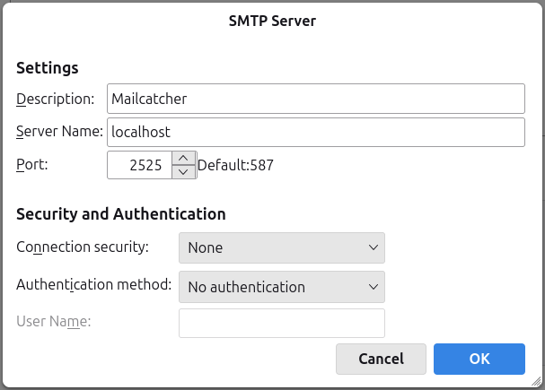

# MailCatcher

## About

Samuel Cochran's [MailCatcher](https://mailcatcher.me/) runs a super
simple SMTP server which catches any message sent to it, and displays
them in a web interface. Great for development and testing!

This code packages MailCatcher as a container image.
This image is based on
[Dietrich Rordorf](https://github.com/rordi/docker-mailcatcher)'s
Dockerfile, and customized to:

- Modify the start command
- Run as a non-root user
- Pin software versions to create immutable images
- Add Netcat (`nc`) & `ssmtp` for testing

## Usage

### Start The Container

#### Podman / Docker

To use this image, exposing the SMTP and HTTP services on unprivileved
ports, run the container with `podman` (ideally as a **non-root user**):

```sh
podman run --detach --rm \
  --publish 2525:2525 \
  --publish 8080:8080 \
  --name mailcatcher \
  ghcr.io/clifford2/mailcatcher:0.10.0-12.20251231
```

To run it with Docker, simply replace `podman` with `docker` in the
above command (and other examples below).

Some tools may be easier to test if the SMTP service is running on port
**587** ([RFC 6409](https://datatracker.ietf.org/doc/html/rfc6409)) or
**25**. To do that, simply change the hostPort (left side number) in the
above `--publish` arguments.

Here's an example, running the SMTP server on port 587, and the web
server on port 80:

```sh
sudo podman run --detach --rm \
  --publish 587:2525 \
  --publish 80:8080 \
  --name mailcatcher \
  ghcr.io/clifford2/mailcatcher:0.10.0-12.20251231
```

#### Docker Compose

A sample [`docker-compose.yml`](samples/docker-compose.yml) file is
provided. You can use it by running:

```sh
docker compose up -d
```

This can easily be incorporated into an existing `docker-compose.yml`
file to add an email service to existing applications.

#### Kubernetes

An example Kubernetes manifest file is provided in [`samples/k8s.yaml`](samples/k8s.yaml).
It contains a Deployment, Services for the HTTP and SMTP ports, and an
Ingress for the HTTP port.

This example would require some customization to work in your cluster, at
least for the Ingress.

### Sending Email

You can send a test email with our `hello` script inside the container
image (uses netcat):

```sh
podman exec mailcatcher hello
```

Here are some other examples of how to send email to MailCatcher. These
examples assume you're running the server on port 2525 - please change the
port number (in the commands below, or in your config files), if you're
using a different port.

Tools for sending email messages include (examples below):

- Tools available in the container image:
	- Netcat
	- ssmtp - sample config file in [`samples/ssmtp.conf`](samples/ssmtp.conf)
- Other tools:
	- socat
	- [msmtp](https://marlam.de/msmtp/) - sample config file in [`samples/.msmtprc`](samples/.msmtprc)
	- Good old Telnet (interactive): `telnet 0.0.0.0 2525`

Example commands for netcat / socat:

```sh
# Define a sample SMTP conversation:
BASEMSG="HELO mailcatcher.example.com
MAIL FROM: nobody@example.com
RCPT TO: mailcatcher@example.org
DATA
Subject: CLI Test Message
Content-Type: text/plain

Hello Buddy

What's up?

Regards,
MailCatcher
.
quit"

# Send using netcat from inside the container:
MSG=$(echo "${BASEMSG}" | sed -e 's/nobody/netcat/')
podman exec mailcatcher sh -c "echo \"${MSG}\" | nc 0.0.0.0 2525"

# Send using socat (installed locally):
MSG=$(echo "${BASEMSG}" | sed -e 's/nobody/socat/')
echo "${MSG}" | socat - TCP4:0.0.0.0:2525
```

Examples using the `ssmtp` & `msmtp` tools & our sample config files:

```sh
# Define a sample email message:
MSG="To: Jade McDonald <JadeMcDonald@example.invalid>
From: Stefan Vogel <StefanVogel@mailinator.com>
Subject: CLI Test Message
Content-Type: text/plain

Hi Jade,

It's been ages - hope life's treating you well; let's catch up soon!

Regards,"

# Send using ssmtp (installed locally):
/usr/bin/echo -e "${MSG}\nlocal ssmtp" | ssmtp -C samples/ssmtp.conf -t

# Send using ssmtp from inside the container:
/usr/bin/echo -e "${MSG}\ncontainer ssmtp" | podman exec -i mailcatcher ssmtp -t

# Send using msmtp (installed locally):
/usr/bin/echo -e "${MSG}\nmsmtp" | msmtp --file samples/.msmtprc --read-envelope-from --read-recipients
```

Of course you can also configure your favourite email application to use
MailCatcher as outgoing mail server / relay. Here is an example for
[Thunderbird](https://www.thunderbird.net/):



### View Messages

View the caught emails in the web interface (at <http://127.0.0.1:8080/>
if running in Podman / Docker).

## Resources

- Container image available at:
	- [`ghcr.io/clifford2/mailcatcher`](https://github.com/clifford2/mailcatcher/pkgs/container/mailcatcher)
	- [`docker.io/cliffordw/mailcatcher`](https://hub.docker.com/r/cliffordw/mailcatcher)
- MailCatcher source code: <https://github.com/sj26/mailcatcher>
- Docker build based on <https://github.com/rordi/docker-mailcatcher>

## License & Disclaimer

This code is shared under the MIT License.

[MailCatcher](https://mailcatcher.me/) is © 2010-2019 Samuel Cochran.

The original Dockerfile is © 2016 Dietrich Rordorf
<https://github.com/rordi>.

Dockerfile modifications, and all other files in this repo are
© 2019 Clifford Weinmann <https://www.cliffordweinmann.com/>.

This code is provided *AS IS*, without warranty of any kind.
See [`LICENSES/MIT.txt`](LICENSES/MIT.txt) for the full license text and disclaimer.

## Security

This code is updated as often as possible, but support is provided on
a best effort basis only.

Please report any problems or vulnerabilities by opening a
[GitHub issue here](https://github.com/clifford2/mailcatcher/issues).
